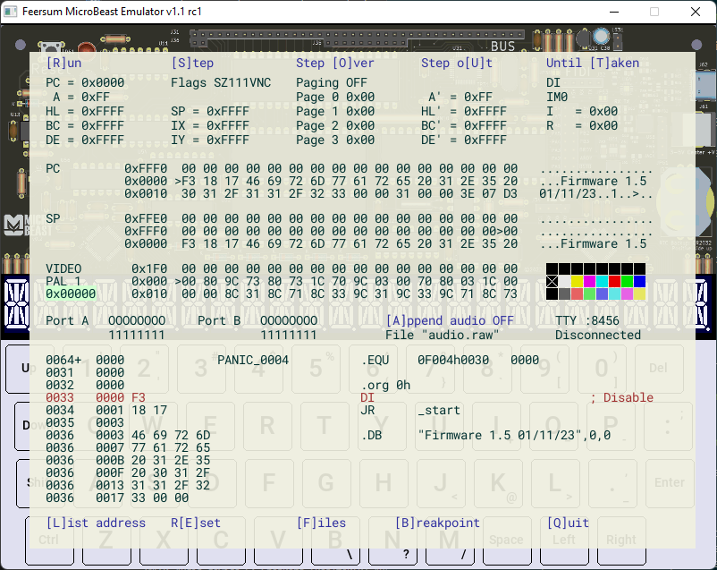

# Feersum MicroBeast Emulator

Emulator for the [MicroBeast Z80 computer kit](https://feertech.com/microbeast/). Features include:

* 512K RAM, 512K ROM (4x16K paging)
* Z80 PIO with software I2C bus
* 24 Character, 14 segment LED display
* RTC
* 16C550 UART
* I/O mapped keyboard
* 1 bit audio

The emulator is cycle stepped, running under Windows and Linux with the SDL2 library. Win64 binaries are available under the release directory.

It includes a simple debugger and disassembler, serial out to console, audio dump and integration with assembly listing files. Assembly files are pinned to memory pages, allowing the correct view for resident programs running at the same physical memory address.

All of the main features of MicroBeast are emulated, allowing software to be developed for the machine and similar Z80 architectures.

# Running

Precompiled binaries are available for Windows-64 in the [Release section](https://github.com/atoone/BeastEm/releases) on GitHub. Download the .zip file and run `beast.bat` to start the emulator. Note you will need to run from the command line if you wish to enable VideoBeast emulation (the `-d` or `-d2` command line options).

Linux and OSX users should follow the build instructions below to create the ``beastem`` exectutable which should be copied to a directory along with the files in the `assets` folder in order to run BeastEm.

## Default MicroBeast Firmware

If no parameters are supplied, BeastEm will start the emulator up with a recent ROM image of the [MicroBeast firmware](https://github.com/atoone/MicroBeast/wiki/Firmware). This supplies a memory editor, YModem download utility and CP/M 2.2 environment with a few programs to try out. This is equivalent to running with the command line:

```
beastem -f flash_v1.5.bin -l 0 firmware.lst -l 23 monitor.lst
```

Supplying a `-f` binary file command line option will override this behaviour, so the emulator can be started with your own custom firmware.

## Command line options

The following command line options may be used:

| Option | Description |
|--------|-------------|
| `-f [address] filename` | Read binary file into memory at address (hex), or 0 if no address given |
| `-l [page] listing` | Read listing file and link it to memory page (hex), or page 0 if no page given |
| `-a device-id`  | Use audio device with the given ID, instead of default |
| `-s sample-rate` | Sample audio at the given rate. Use 0 to turn off audio |
| `-v volume`     | Set volume, 0-10. Default is 5 |
| `-k cpu-speed`  | Set the CPU clock speed, in Kilohertz. Default is 8000 (for 8MHz) |
| `-b breakpoint` | Stop at the given breakpoint (hex) |
| `-z zoom`       | Zoom the display size by the given factor (float) |
| `-d filename` or `-d2 filename`   | Enable VideoBeast Emulation (`d2` scales display x2), loading file into video RAM. (e.g. use `videobeast.dat`) |

## Listing Files

BeastEm will synchronise debug with listing files in the TASM or sjsmplus format (each line consisting of a line number, one or more spaces and then the assembly address in hex). Other formats may be supported in future.

A listing file is pinned to the memory page it is loaded into, as well as the physical address in the listing itself. This allows code paged in to memory to be correctly identified.

If the hex bytes in the listing file do not match the current memory contents, BeastEm will disassemble the location.

## Controlling BeastEm

The Emulator starts in the debug view, showing the state of the CPU, PIO and a disassembly or listing of the current execution address. When the emulator is running, the debug view is hidden and keyboard input goes directly to MicroBeast. At any time, hitting `ESCAPE` will return to the debug view.



In the debug view, most commands take a single keypress. The currently implemented commands are:

| Key | Command |
|-----|---------|
| `R` | Run the emulator until `ESCAPE` pressed or breakpoint is reached                             |
| `S` | Single step - execute one instruction                                                        |
| `O` | Run until the following instruction is reached (eg. **O**ver a `CALL` or `DJNZ` instruction) |
| `U` | Run until the current subroutine is returned from.                                           |
| `T` | Run until the current conditional branch is **T**aken                                        |
| `L` | Toggle listing following PC, or at specific address                                          |
| `E` | Soft reset CPU                                                                               |
| `F` | File management: Load source and binary files                                                |
| `B` | Toggle breakpoint, edit value when breakpoint enabled                                        |
| `D` | When a terminal is connected over a network port, **D**isconnect it and await a new connection |
| `A` | Toggles appending audio output to the chosen audio file                                      |
| `Q` | Quit                                                                                         |
| `Up`, `Down`    | Select debug values for editing                                                  |
| `Left`, `Right` | Update selected item (increment/decrement registers, select memory view etc.)    |

When a value is selected, hitting `Enter` will allow a new value to be set, or toggle a binary `On|Off` value.

Besides showing the address pointed to by register pairs, the memory views also allow memory to be directly
inspected and edited. `Z80` views the CPU's logical memory map (0-64K), whereas the `PAGE` option allows any page
in the 1Mb physical memory (512K ROM, 512K RAM) to be examined. When VideoBeast is enabled, `Video RAM`
allows video memory, registers and palettes to be viewed and edited.

## Serial over Network

A terminal can be connected to the emulated MicroBeast UART over a network socket. Data sent to and from the terminal
will be handled as though sent to the UART at whatever Baud rate it is configured for.

To connect a terminal, ensure the debug screen is visible and check the port number displayed next to the `TTY` menu
option (default 8456). Open your preferred terminal program and connect to `localhost:8456`. The debug window will
indicate when a connection is made, and the `D` key will disconnect and await a new connection.

The UART simulates hardware handshake (no data is discarded or overrun), and the 16C550 RX/TX FIFO, but does not
currently implement interrupts, so software must poll the UART directly for its state.

# Building

## Windows

BeastEm uses SDL2, and is compiled with g++.

Windows users can install g++ with MySys64, following [this guide](https://code.visualstudio.com/docs/cpp/config-mingw). The project can then be build in VisualCode, producing an executable with all supporting files in `release\win64`.

## Linux

Linux users will need to install the SDL2 development libraries, along with build tooling if needed and GTK+-3. E.g.
on Debian (Bookworm and above):

```shell
sudo apt-get install build-essential cmake git gtk+3-dev libsdl2-dev libsdl2-net-dev libsdl2-image-dev libsdl2-ttf-dev libsdl2-gfx-dev
```

Some distributions, notably Red Hat-based ones, call these `-devel` instead of `-dev` - You _do_ need the development
packages to get the appropriate headers and CMake files. On Fedora, for example:

```shell
sudo dnf install gcc gcc-c++ cmake git gtk3-devel SDL2-devel SDL2_net-devel SDL2_image-devel SDL2_ttf-devel SDL2_gfx-devel
```

> **Note**: Debian Bullseye (and older) are not officially supported by the CMake build, due to missing modern CMake
  files in the standard SDL2 dependencies from `apt`. If you are set on building on such a platform, then the recommended
  path is to use [Linuxbrew](https://docs.brew.sh/Homebrew-on-Linux) and avoid using any of the built-in `apt`
  package dependencies which will use conflicting `glibc`.

Build the executable with:

```shell
cmake .
make clean all
```

which should find the appropriate includes and libraries for you. Alternatively, you can build manually with e.g:

```shell
g++ -w -O2 -o beastem beastem.cpp src/*.cpp -I/usr/include/SDL2 -D_REENTRANT -lSDL2 -lSDL2_ttf -lSDL2_gfx -lSDL2_net
```

(This assumes all SDL2 include files have been installed to `/usr/include/SDL2`).

Once the executable is built, copy it and the files in the `assets` folder to the desired location to run BeastEm.

## macOS

Install the required SDL libraries, along with cmake if necessary, for example using [homebrew](https://brew.sh/):

```shell
brew install cmake sdl2 sdl2_gfx sdl2_image sdl2_net sdl2_ttf
```

And build with:

```shell
cmake .
make clean all
```

This should find the appropriate includes and libraries for you, and should work on both Intel and Apple Silicon.

Alternatively, you can build manually with e.g:

```shell
g++ -w -O2 -o beastem beastem.cpp src/*.cpp -I/usr/include/SDL2 -D_REENTRANT -lSDL2 -lSDL2_ttf -lSDL2_gfx -lSDL2_net
```

Assuming a homebrew installation on Apple Silicon, the libraries and include files will be in `/opt/homebrew`. To compile, install the Xcode command line tools, and then run:

```shell
clang++ -w --std=c++20 -O2 -o beastem beastem.cpp src/*.cpp -I /opt/homebrew/include/SDL2 -D_REENTRANT -lSDL2 -lSDL2_ttf -lSDL2_gfx -lSDL2_net
```

If all goes well this will create the `beastem` binary which can be copied with the files from the `assets` folder and run alongside them.

# Limitations

The emulator is a **work in progress**, and assumes relatively well behaved code. Particularly, the exact timings of some of the perphierals has not been implemented. Overall performance is not a priority, so it may require a relatively powerful PC to run.

BeastEm is one part of a much bigger project to build a unique new computer, so other parts of that larger project may take precedence.

VideoBeast is currently prototype hardware, with some features (noteably sprites and SD-Card access) not yet available. BeastEm emulates the current APIs reasonably accurately. More information is on the VideoBeast [introduction Page](VIDEOBEAST.md)

Some features of MicroBeast are not yet implemented:

* RTC Alarms, battery monitoring
* PIO inputs

# Help

Further information on MicroBeast can be found at [the Wiki](https://github.com/atoone/MicroBeast/wiki), or the [Feersum Technology Website](https://feertech.com/microbeast/)

If you find this tool useful, please let me know. Positive reinforcement really helps!

If there are omissions, bugs or you have suggestions or code to contribute - you are very welcome. Please get in contact.

# License

This tool depends on some fantastic libraries, including SDL2, SDL GFX, SDL TTF, and the excellent Z80 core emulators by Andre Weissflog. Accordingly, BeastEm is released under the Zlib license -
