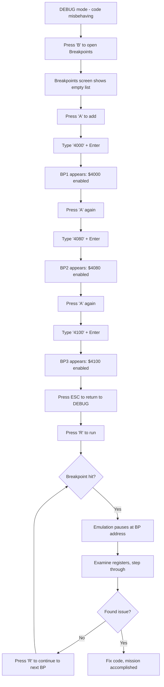
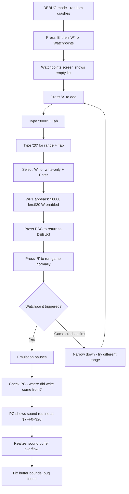

# UX Design Specification beastem

**Author:** Ant
**Date:** 2026-01-30

---

<!-- UX design content will be appended sequentially through collaborative workflow steps -->

## Executive Summary

### Project Vision

Enhance BeastEm's debugging experience by providing a dedicated, keyboard-driven UI for managing multiple breakpoints and watchpoints. This replaces the current single-breakpoint inline approach with a purpose-built screen that enables complex debugging scenarios - setting multiple breakpoints across a code path, monitoring memory regions for corruption - while maintaining BeastEm's established interaction patterns and visual style.

### Target Users

**Primary Persona: Marcus (Retro Computing Hobbyist)**
- Software engineer by day, Z80 hobbyist by night
- Competent programmer but rusty with assembly (last coded Z80 in the 80s)
- Works in evening sessions with limited time
- Building arcade games for MicroBeast
- Currently frustrated by tedious single-breakpoint workflow
- Needs efficient debugging to maintain momentum on hobby projects

**User Characteristics:**
- Comfortable with keyboard-driven interfaces
- Familiar with hex addresses and memory concepts
- Values efficiency over discoverability (willing to learn shortcuts)
- Expects debugger conventions but will adapt to BeastEm's patterns

### Key Design Challenges

1. **Keyboard-only CRUD operations** - Efficient add/edit/delete/toggle for list items without mouse, using patterns consistent with existing BeastEm debug UI

2. **Multi-field data entry** - Streamlined flow for entering address + optional bank (breakpoints) or address + range + type (watchpoints) without feeling cumbersome

3. **Information density** - Displaying 8 breakpoints or 8 watchpoints with full details (address, bank/range, type, status) in a clear, scannable format

4. **Modal integration** - Seamless navigation between DEBUG mode and new BREAKPOINTS mode, with clear mental model of where user is and how to return

### Design Opportunities

1. **Single-key quick-toggle** - Enable/disable items directly from list without entering edit mode, dramatically speeding up common workflow

2. **Visual status encoding** - Leverage color/brightness to instantly communicate enabled/disabled state and item type

3. **Smart defaults** - Minimize keystrokes for common cases (write watchpoints, single-byte range, logical addressing)

4. **Consistent patterns** - Apply existing BeastEm editing patterns (Enter to edit, arrows to navigate) so users transfer existing muscle memory

## Core User Experience

### Defining Experience

The breakpoint/watchpoint UI exists to make debugging setup **invisible** - Marcus should spend his mental energy on understanding his code's behavior, not on managing the debugger. The core experience is: see something suspicious → set breakpoint → run → hit it → understand. Every interaction in this UI serves that loop.

**Core User Actions (by frequency):**
1. Add breakpoint at address (most common)
2. Toggle enable/disable on existing item
3. Add watchpoint on memory range
4. Delete breakpoint/watchpoint
5. Edit existing item's properties

### Platform Strategy

| Aspect | Decision |
|--------|----------|
| Platform | Desktop only (Windows, Linux, macOS) |
| Input | Keyboard-driven, no mouse required |
| Rendering | SDL2 custom rendering (consistent with existing UI) |
| Integration | New mode within existing debug state machine |
| Accessibility | Keyboard-only by design; visual feedback through color/brightness |

### Effortless Interactions

**Must be instant (zero friction):**
- Add breakpoint: 'A' → type hex address → Enter (3 actions)
- Toggle enable/disable: Select item → Spacebar (1 action)
- Switch tabs: Tab key or number keys (1 action)
- Return to debug view: ESC (1 action)

**Should be fast (minimal friction):**
- Add watchpoint: 'A' → address → range → type → Enter
- Edit existing item: Enter → modify → Enter
- Delete item: 'D' or Delete key with selection

**Automatic behaviors:**
- New breakpoints default to enabled
- New watchpoints default to write-only, 1-byte range
- Logical addressing as default (physical as explicit choice)

### Critical Success Moments

1. **The catch** - Watchpoint triggers on unexpected memory write. Marcus sees exactly where corruption happened. "This would have taken hours without watchpoints."

2. **The flow** - Marcus sets up 3 breakpoints across his game loop in under 15 seconds. No friction, no mode confusion. He's debugging, not fighting the debugger.

3. **The preservation** - After finding one bug, Marcus disables those breakpoints and sets new ones for the next issue. His previous setup remains intact for later.

4. **The clarity** - Glancing at the breakpoint list, Marcus instantly sees 2 of 5 are enabled without reading any text. Visual status encoding works.

### Experience Principles

1. **Speed over ceremony** - Every interaction optimized for minimum keystrokes. No confirmations, no "are you sure?" dialogs. Trust the user.

2. **Preserve debugging context** - Toggle is the primary state change, not delete. Make it trivial to disable/re-enable. Never lose user's address setup.

3. **Glanceable status** - Visual encoding communicates state instantly. Enabled items bright, disabled items dim. No need to read details to understand what's active.

4. **Consistent muscle memory** - Follow existing BeastEm keyboard patterns exactly. Enter to edit, arrows to navigate, ESC to exit. Transfer existing skills.

5. **Smart defaults, easy overrides** - Defaults cover 80% of use cases (logical address, write watchpoint, 1 byte). Override any default with minimal extra effort.

## Desired Emotional Response

### Primary Emotional Goals

**In Control** - The dominant feeling Marcus should have. He has powerful debugging tools at his fingertips. The UI responds instantly and predictably. He's hunting the bug, not wrestling the debugger.

**Supporting Emotions:**
- **Confident** - Every interaction feels obvious and learnable. No guessing.
- **Efficient** - Setup is fast. Time is spent understanding code, not managing breakpoints.
- **Focused** - The UI presents exactly what's needed, nothing more. Mental energy stays on the debugging problem.

### Emotional Journey Mapping

| Stage | Starting State | Target Emotion | Design Support |
|-------|---------------|----------------|----------------|
| Enter breakpoint UI | Frustrated (code broken) | Curious, ready to investigate | Clean, inviting interface |
| Set breakpoints | Task-focused | Swift completion, "that was easy" | Minimal keystrokes, instant feedback |
| Run and hit breakpoint | Anticipation | Informed, "now I see the state" | Clear break indication, context visible |
| Find the bug | Searching | Accomplishment, satisfaction | Watchpoint shows exact culprit |
| Return next session | Neutral | Confidence, "I have good tools" | Familiar patterns, quick re-orientation |

### Micro-Emotions

**Critical micro-emotions to get right:**

1. **Confidence over Confusion** - Every key does one obvious thing. No modes within modes. If unsure, visible hints guide the user.

2. **Accomplishment over Frustration** - Finding a bug via watchpoint should feel like a win. The tool helped. Setup friction is eliminated so the victory isn't overshadowed by tool struggle.

3. **Trust over Skepticism** - When a breakpoint or watchpoint triggers, Marcus must trust it completely. 100% accuracy, clear indication of what triggered (address, access type).

**Micro-emotions to monitor:**
- Moment of adding first breakpoint: Should feel instant, not bureaucratic
- Moment of toggling enable/disable: Should feel lightweight, reversible
- Moment of seeing the list: Should feel organized, scannable, not overwhelming

### Design Implications

**To create "in control" feeling:**
- All state visible at all times (no hidden breakpoints, no mystery modes)
- Every keypress produces immediate, visible feedback
- Predictable: same key always does same thing regardless of context

**To create "confident" feeling:**
- Consistent with existing BeastEm patterns (transfer existing knowledge)
- Single way to accomplish each task (no "you could also...")
- Visual hints for available actions when helpful

**To create "efficient" feeling:**
- Optimize for minimum keystrokes on common paths
- Smart defaults eliminate unnecessary decisions
- No confirmation dialogs - trust the user, make undo easy instead

**To prevent negative emotions:**
- Confusion → Clear visual hierarchy, obvious current selection
- Frustration → Fast response (<16ms), no waiting, no "processing"
- Anxiety → Toggle preserves setup, nothing lost accidentally

### Emotional Design Principles

1. **Respond instantly** - Every interaction completes in one frame. No spinners, no delays. Instant feedback builds confidence and control.

2. **Make state obvious** - Never make Marcus wonder "is this enabled?" or "am I in edit mode?". Visual encoding answers before the question forms.

3. **Reward with clarity** - When a breakpoint hits, the reward is understanding. Show the relevant context immediately. Make the "aha moment" as clear as possible.

4. **Forgive mistakes** - Toggle instead of delete. Easy to undo. No "are you sure?" - just make recovery trivial.

5. **Fade away** - The best debugger UI is one Marcus forgets he's using. The tool should feel like an extension of his thinking, not a separate thing to manage.

## UX Pattern Analysis & Inspiration

### Inspiring Products Analysis

**Primary Inspiration: BeastEm's Existing Debug UI**

The most important source of UX patterns is BeastEm itself. Users already know how to interact with the debugger - hex entry, arrow navigation, Enter to edit, ESC to exit. The breakpoint/watchpoint UI must feel like a natural extension of what exists, not a foreign addition.

**Existing BeastEm patterns that work well:**
- **Inline hex editing** - Clean, fast entry of addresses and values
- **Color highlighting** - Active/selected items visually distinct
- **Dropdown selection** - Multi-choice fields presented as scrollable options
- **Keyboard navigation** - Arrows to move, Enter to select/edit, ESC to cancel/exit
- **Information density** - Compact hex display, efficient use of screen space
- **On-screen key hints** - Available actions shown on screen for discoverability

**Secondary Inspiration: Established Debugger Conventions**

While BeastEm patterns take priority, certain debugger conventions are universal enough to adopt:
- Breakpoint lists with enable/disable toggle
- Visual distinction between breakpoint types
- Address display with optional bank/segment qualifier

### Transferable UX Patterns

**From BeastEm (adopt directly):**

| Pattern | Application |
|---------|-------------|
| Hex entry field | Breakpoint address, watchpoint address, watchpoint range |
| Color highlight (e.g., yellow/cyan) | Enabled items in list, selected item |
| Dropdown selector | Watchpoint type (R/W/RW), address mode (logical/physical) |
| Arrow key list navigation | Moving through breakpoint/watchpoint list |
| Enter to edit | Opening selected item for modification |
| ESC to exit | Returning from BP/WP screen to debug view |
| On-screen key hints | Show available actions (A:Add, D:Delete, etc.) in footer/sidebar |

**From common conventions (adopt with BeastEm styling):**

| Pattern | Application | Adaptation |
|---------|-------------|------------|
| Tab switching | BP/WP tab navigation | Use Tab key or 1/2 number keys |
| Spacebar toggle | Enable/disable without edit | Quick toggle from list view |
| 'A' to add | Create new item | Common in list-based UIs |
| 'D' or Delete to remove | Delete selected item | With visible selection |

### Anti-Patterns to Avoid

**Generic UI anti-patterns:**
- **Confirmation dialogs** - "Are you sure?" slows workflow, breaks flow state
- **Mouse-required interactions** - Breaks keyboard-only commitment
- **Hidden modes** - User should always know current state
- **Inconsistent shortcuts** - If Enter edits elsewhere, Enter must edit here
- **Hidden keyboard shortcuts** - Actions should have visible hints on screen

**Debugger-specific anti-patterns:**
- **Overly complex conditional breakpoints** - Save for future DeZog integration, not MVP
- **Invisible breakpoint state** - Must see enabled/disabled at a glance
- **Modal address entry** - Hex entry should match existing BeastEm feel, not pop up a dialog

**BeastEm-specific anti-patterns to avoid:**
- **Breaking existing muscle memory** - Don't reassign keys users already know
- **Different visual language** - Use same colors, fonts, spacing as existing debug view
- **Slower response than current UI** - Match or exceed current responsiveness
- **Missing key hints** - Unlike existing screens that show available actions

### Design Inspiration Strategy

**Adopt directly from BeastEm:**
- All input patterns (hex entry, dropdown, arrow navigation)
- All visual patterns (color highlight, information density, font choices)
- All exit patterns (ESC to return, Enter to confirm)
- On-screen key hints showing available actions

**Adopt from conventions with BeastEm styling:**
- Tab-based navigation between Breakpoints and Watchpoints
- Spacebar for quick toggle (doesn't conflict with existing BeastEm keys)
- 'A' to add new item (common, intuitive)
- 'D' or Delete to remove (common, intuitive)

**Intentionally avoid:**
- Any pattern requiring mouse interaction
- Any pattern that introduces confirmation dialogs
- Any visual style that doesn't match existing BeastEm aesthetic
- Any feature complexity beyond MVP scope (conditional breakpoints, hit counts)

**Design principle:** When in doubt, do what BeastEm already does. Consistency is more valuable than theoretical improvement.

## Design System Foundation

### Design System Choice

**Approach: Extend BeastEm's Existing Visual System**

BeastEm is a C++/SDL2 application with custom rendering - no external design system (Material, Tailwind, etc.) applies. The "design system" is BeastEm's established visual language, which the breakpoint/watchpoint UI will extend.

This is not a limitation but an advantage: complete visual consistency is guaranteed by using the same rendering code and patterns as existing screens.

### Rationale for Selection

1. **Technical constraint** - SDL2 custom rendering doesn't support web-style design systems
2. **Consistency imperative** - New UI must be visually indistinguishable from existing debug views
3. **Zero learning curve** - Reuse existing rendering functions, colors, fonts, layout constants
4. **Proven patterns** - BeastEm's visual language has been refined through actual use

### Implementation Approach

**Reuse existing rendering infrastructure:**

| Component | Existing Code | Application |
|-----------|---------------|-------------|
| Text rendering | `gui.cpp` text functions | Labels, addresses, hints |
| Hex fields | Existing hex edit pattern | Address entry, range entry |
| Dropdown menus | Existing dropdown pattern | Watchpoint type, address mode |
| List rendering | Debug view list patterns | Breakpoint/watchpoint lists |
| Highlighting | Existing color constants | Selection, enabled state |

**New rendering needed:**
- Tab indicator (Breakpoints / Watchpoints) - minimal, text-based
- List item layout for BP/WP entries - compose from existing primitives

### Customization Strategy

**No customization needed** - the goal is exact visual match with existing BeastEm screens.

**Visual tokens to reuse from existing code:**
- Font sizes and faces (RobotoMono for hex, Roboto for UI text)
- Color palette (selection highlight, enabled/disabled states, text colors)
- Spacing constants (COL1, ROW1, standard margins)
- Component patterns (how dropdowns render, how hex fields behave)

**Implementation principle:** Copy visual patterns from existing `gui.cpp` and `beast.cpp` rendering code. If a visual element looks different from existing screens, it's a bug.

## Defining Interaction

### The Defining Experience

**"Add breakpoint at address in 3 keystrokes"**

The core interaction that defines this feature's success: Marcus thinks "I want to break at $4080" and has a breakpoint there in under 2 seconds. If this feels instant and effortless, the entire feature succeeds. Everything else (watchpoints, editing, toggling, deleting) builds on this foundation.

**The complete user story in one sentence:**
"Set a breakpoint, run, catch the bug."

### User Mental Model

**Current workflow (without this feature):**
1. Insert `HALT` instruction in source code
2. Recompile the program
3. Load new binary into emulator
4. Run until it halts
5. Examine state
6. Remove `HALT`, add another elsewhere
7. Repeat from step 2

**Mental model:** "I want to pause execution at a specific point to see what's happening."

**Expectation for new UI:** Type an address → breakpoint exists. No compilation, no file changes, instant.

**Key insight:** Marcus doesn't think in terms of "breakpoint objects with properties." He thinks "stop here." The UI should match this mental model - address first, everything else optional.

**Address mental model:**
- 4 hex digits (e.g., `4080`) = logical address in 64K Z80 address space
- 5 hex digits (e.g., `84080`) = physical address in 1MB memory space
- No separate "bank" concept in UI - address length determines type

### Success Criteria

| Criteria | Target | Rationale |
|----------|--------|-----------|
| Keystrokes to add breakpoint | ≤3 (A → address → Enter) | Speed over ceremony |
| Time from thought to breakpoint | <2 seconds | Faster than inserting HALT |
| Visual confirmation | Instant | Item appears in list immediately |
| Error handling | Inline, non-blocking | Invalid hex ignored, no dialogs |
| Mental load | Zero | No mode confusion, obvious state |
| Discoverability | On-screen hints | New users see available keys |

**Success indicators:**
- Marcus never thinks about the UI - he thinks about his code
- Setup time becomes negligible compared to analysis time
- "I should set a breakpoint" immediately becomes "I have a breakpoint"

### Novel UX Patterns

**Pattern classification: 100% Established**

No novel interaction patterns required. Every interaction uses patterns Marcus already knows from BeastEm or universal computing conventions:

| Interaction | Pattern Type | User Already Knows From |
|-------------|--------------|------------------------|
| Navigate list | Established | BeastEm debug view, every list UI |
| Add item | Established | Common 'A' convention |
| Enter hex address | Established | BeastEm's existing hex entry |
| Toggle enable | Established | Spacebar toggle |
| Delete item | Established | 'D' or Delete key |
| Switch screens | Established | 'B'/'W' mnemonic keys |
| Exit screen | Established | ESC key, BeastEm pattern |

**No user education needed.** The interaction should feel familiar from the first use.

### Experience Mechanics

**Primary Flow: Add Breakpoint**

```
┌─────────────────────────────────────────────────────────┐
│ 1. INITIATION                                           │
│    User in DEBUG mode, presses 'B'                      │
│    → Breakpoints screen appears                         │
│    → List shown with existing breakpoints (if any)      │
│    → Selection on first item or empty state             │
│    → Key hints visible: A:Add D:Del Space:Toggle W:Watch│
└─────────────────────────────────────────────────────────┘
                          │
                          ▼
┌─────────────────────────────────────────────────────────┐
│ 2. INTERACTION                                          │
│    User presses 'A' to add                              │
│    → New row appears with hex entry field focused       │
│    User types "4080" (or "84080" for physical)          │
│    → Each character appears instantly                   │
│    → Invalid chars silently rejected                    │
│    User presses Enter                                   │
└─────────────────────────────────────────────────────────┘
                          │
                          ▼
┌─────────────────────────────────────────────────────────┐
│ 3. FEEDBACK                                             │
│    Breakpoint created and shown in list:                │
│    → Address displayed: $4080 or $84080                 │
│    → State: Enabled (highlighted color)                 │
│    → Item selected in list                              │
└─────────────────────────────────────────────────────────┘
                          │
                          ▼
┌─────────────────────────────────────────────────────────┐
│ 4. COMPLETION                                           │
│    User sees breakpoint in list                         │
│    Can immediately:                                     │
│    → 'A' to add another                                 │
│    → 'W' to switch to watchpoints                       │
│    → ESC to return to DEBUG and run                     │
│    Breakpoint is active and will trigger                │
└─────────────────────────────────────────────────────────┘
```

**Secondary Flow: Add Watchpoint**

```
┌─────────────────────────────────────────────────────────┐
│ 1. INITIATION                                           │
│    From Breakpoints screen, press 'W'                   │
│    → Watchpoints screen appears                         │
│    → Key hints: A:Add D:Del Space:Toggle B:Break        │
└─────────────────────────────────────────────────────────┘
                          │
                          ▼
┌─────────────────────────────────────────────────────────┐
│ 2. INTERACTION                                          │
│    User presses 'A' to add                              │
│    → New row with address field focused                 │
│    Type address (e.g., "8000")                          │
│    Tab → Range field (default: 01)                      │
│    Tab → Type dropdown (R/W/RW, default: W)             │
│    Enter to confirm                                     │
└─────────────────────────────────────────────────────────┘
                          │
                          ▼
┌─────────────────────────────────────────────────────────┐
│ 3. FEEDBACK & COMPLETION                                │
│    Watchpoint created and shown:                        │
│    → Address: $8000                                     │
│    → Range: 01 (1 byte)                                 │
│    → Type: W (write)                                    │
│    → State: Enabled (highlighted)                       │
└─────────────────────────────────────────────────────────┘
```

**Error Handling:**
- Invalid hex character → ignored (cursor stays, no feedback needed)
- List full (8 items) → 'A' does nothing, hint updates to show "Full"
- ESC during add → cancels, no item created

**Keyboard Map:**

| Key | Action | Context |
|-----|--------|---------|
| B | Enter BP screen | From DEBUG mode |
| B | Switch to BP screen | From Watchpoints screen |
| W | Switch to WP screen | From Breakpoints screen |
| ↑/↓ | Navigate list | List view |
| A | Add new item | List view (if not full) |
| Enter | Edit selected / Confirm | List view / Edit mode |
| Space | Toggle enable/disable | List view |
| D / Delete | Delete selected | List view |
| Tab | Next field | Edit mode (WP: addr→range→type) |
| ESC | Cancel / Exit to DEBUG | Edit mode / List view |

## Visual Design Foundation

### Color System

**Approach: Match existing BeastEm debug view colors exactly.**

| Semantic Use | Source | Notes |
|--------------|--------|-------|
| Background | Existing debug view | Dark background |
| Text (normal) | Existing debug view | Light text for readability |
| Text (dim) | Existing debug view | Disabled items, secondary info |
| Selection highlight | Existing debug view | Currently selected item |
| Enabled state | Existing breakpoint color | Bright/highlighted |
| Disabled state | Dimmed variant | Visually distinct from enabled |

**Implementation:** Extract color constants from existing `gui.cpp` / `beast.cpp` rendering code. Do not introduce new colors.

### Typography System

**Fonts (existing BeastEm assets):**
- `RobotoMono-VariableFont_wght.ttf` - Hex values, addresses, code
- `Roboto-Medium.ttf` - Labels, UI text, hints

**Usage:**
- All addresses and hex values: RobotoMono
- Screen titles, key hints: Roboto
- Match existing font sizes from debug view

### Spacing & Layout Foundation

**Approach: Use existing BeastEm layout constants.**

- Reuse `COL1`, `ROW1`, and similar positioning constants
- Match existing debug view margins and padding
- List item height should match existing list patterns
- Screen fits within existing debug view area

### Accessibility Considerations

- High contrast maintained (dark background, light text)
- Color not sole indicator of state (enabled/disabled also shown via brightness)
- Keyboard-only operation (no mouse required)
- All interactive elements have visible focus state

## Design Direction

### Design Direction Explored

**Single direction: Match existing BeastEm debug view exactly.**

No alternative visual directions were explored because the design constraint is clear: the breakpoint/watchpoint screens must be visually indistinguishable from existing BeastEm debug screens. This is the correct approach for a brownfield feature addition.

### Chosen Direction

**Text-based list UI with fixed 8-slot display**

**Breakpoints Screen:**
```
┌─────────────────────────────────────────────────────────────┐
│  BREAKPOINTS                              [W]:Watchpoints   │
├─────────────────────────────────────────────────────────────┤
│                                                             │
│  #  Address   Enabled                                       │
│  ─────────────────────                                      │
│  1  $4080     [*]      ◄── selected (highlighted)           │
│  2  $4100     [*]                                           │
│  3  $84000    [ ]          (disabled - dimmed)              │
│  4  $8200     [*]                                           │
│  5  ────      ───          (empty slot)                     │
│  6  ────      ───                                           │
│  7  ────      ───                                           │
│  8  ────      ───                                           │
│                                                             │
├─────────────────────────────────────────────────────────────┤
│  A:Add  D:Delete  Space:Toggle  Enter:Edit  ESC:Exit        │
└─────────────────────────────────────────────────────────────┘
```

**Watchpoints Screen:**
```
┌─────────────────────────────────────────────────────────────┐
│  WATCHPOINTS                              [B]:Breakpoints   │
├─────────────────────────────────────────────────────────────┤
│                                                             │
│  #  Address   Range  Type  Enabled                          │
│  ───────────────────────────────────                        │
│  1  $8000     $20    W     [*]      ◄── selected            │
│  2  $7FF0     $10    RW    [*]                              │
│  3  $C000     $01    R     [ ]          (disabled)          │
│  4  ────      ───    ──    ───                              │
│  5  ────      ───    ──    ───                              │
│  6  ────      ───    ──    ───                              │
│  7  ────      ───    ──    ───                              │
│  8  ────      ───    ──    ───                              │
│                                                             │
├─────────────────────────────────────────────────────────────┤
│  A:Add  D:Delete  Space:Toggle  Enter:Edit  ESC:Exit        │
└─────────────────────────────────────────────────────────────┘
```

### Design Rationale

| Element | Decision | Rationale |
|---------|----------|-----------|
| Title position | Top left | Matches existing BeastEm screens |
| Screen switch hint | Top right | Always visible, mnemonic key shown |
| List format | Numbered rows, fixed 8 slots | Clear capacity, easy selection reference |
| Empty slots | Shown as dashes | User sees available capacity at a glance |
| Key hints | Bottom bar | Matches existing BeastEm pattern |
| Column order | Address first | Most important info leftmost |
| Enabled indicator | `[*]` vs `[ ]` | Clear binary state, compact |
| Selection | Highlighted row | Matches existing BeastEm list selection |

### Implementation Approach

**Screen composition:**
1. Title bar with screen name and switch hint
2. Column headers (different for BP vs WP)
3. 8 fixed rows for items (populated or empty)
4. Key hints footer

**Rendering reuse:**
- Title: existing text rendering
- List rows: similar to existing debug list patterns
- Selection highlight: existing highlight color
- Key hints: existing hint bar pattern

**State indication:**
- Enabled items: normal/bright text color
- Disabled items: dimmed text color
- Selected item: background highlight
- Empty slots: dashes in monospace, very dim

## User Journey Flows

### Journey 1: Debugging a Game Loop

**Scenario:** Marcus's sprite movement is buggy. He wants to set breakpoints at joystick read ($4000), sprite update ($4080), and screen draw ($4100) to trace where things go wrong.

**Flow Diagram:**


**Key Interactions:**
- Entry: 'B' from DEBUG mode
- Add breakpoint: A → address → Enter (3 keystrokes per breakpoint)
- Return to debugging: ESC
- Total keystrokes for 3 breakpoints: ~20 (vs. editing source + recompiling)

**Success Criteria:**
- 3 breakpoints set in under 15 seconds
- Each breakpoint triggers at exact address
- Marcus finds the bug (register clobbered between breakpoints)

### Journey 2: Hunting Memory Corruption

**Scenario:** Marcus's game crashes randomly. He suspects his sprite table at $8000-$801F is being corrupted by a buffer overflow somewhere.

**Flow Diagram:**


**Key Interactions:**
- Entry: 'B' then 'W' to reach Watchpoints
- Add watchpoint: A → address → Tab → range → Tab → type → Enter
- Watchpoint fields: address (required), range (default 1), type (default W)
- Return to debugging: ESC

**Success Criteria:**
- Watchpoint catches the errant write
- PC value reveals the culprit routine
- Bug that "could have taken hours" solved in minutes

### Journey Patterns

**Navigation Pattern:**
```
DEBUG ──['B']──► Breakpoints ──['W']──► Watchpoints
                     ▲                      │
                     └────────['B']─────────┘
                     │
              [ESC]  │
                     ▼
                  DEBUG
```

**Add Item Pattern:**
```
List View ──['A']──► Edit Mode ──[Enter]──► List View (item added)
                         │
                      [ESC]
                         │
                         ▼
                   List View (cancelled)
```

**Quick Toggle Pattern:**
```
List View ──[↑/↓]──► Select Item ──[Space]──► Toggle enabled state
                                                (stays in list view)
```

### Flow Optimization Principles

1. **Minimize keystrokes to value**
   - Add breakpoint: 3 keystrokes (A, address, Enter)
   - Toggle enable: 1 keystroke (Space)
   - Delete: 1 keystroke (D)

2. **Smart defaults eliminate decisions**
   - Watchpoint type defaults to Write (most common use case)
   - Range defaults to 1 byte
   - New items default to enabled

3. **No dead ends**
   - ESC always exits current mode
   - Can always switch between BP/WP screens
   - Cancel during add returns to list cleanly

4. **Feedback at every step**
   - Item appears in list immediately on add
   - Enable/disable state visually updates instantly
   - Selection highlight shows current position

5. **Error prevention over error handling**
   - Invalid hex characters simply don't appear
   - Can't add when list is full (hint shows "Full")
   - No destructive action without selection

## Component Strategy

### Existing BeastEm Components (Reuse)

| Component | Source | Usage in BP/WP UI |
|-----------|--------|-------------------|
| Hex entry field | `gui.cpp` | Address input, range input |
| Dropdown selector | `gui.cpp` | Watchpoint type (R/W/RW) |
| Text rendering | `gui.cpp` | Labels, titles, hints |
| Selection highlight | `beast.cpp` | Current list item |
| Key hint bar | Various screens | Footer with available actions |

These components already exist and are proven. Reuse them exactly as-is.

### New Components

#### List Row (Breakpoint)

**Purpose:** Display one breakpoint entry in the list

**Layout:**
```
┌───┬──────────┬─────────┐
│ # │ Address  │ Enabled │
├───┼──────────┼─────────┤
│ 1 │ $4080    │  [*]    │
│ 2 │ $84000   │  [ ]    │
│ 3 │ ────     │  ───    │
└───┴──────────┴─────────┘
```

**States:**
- **Normal:** Default text color, item populated and enabled
- **Disabled:** Dimmed text color, item populated but disabled
- **Selected:** Background highlight on entire row
- **Empty:** Dashes instead of values, very dim color

**Fields:**
- Slot number (1-8): Fixed width, right-aligned
- Address: 4-5 hex digits with `$` prefix, left-aligned
- Enabled: `[*]` for enabled, `[ ]` for disabled

#### List Row (Watchpoint)

**Purpose:** Display one watchpoint entry in the list

**Layout:**
```
┌───┬──────────┬───────┬──────┬─────────┐
│ # │ Address  │ Range │ Type │ Enabled │
├───┼──────────┼───────┼──────┼─────────┤
│ 1 │ $8000    │ $20   │  W   │  [*]    │
│ 2 │ $C000    │ $01   │  RW  │  [ ]    │
│ 3 │ ────     │ ───   │  ──  │  ───    │
└───┴──────────┴───────┴──────┴─────────┘
```

**States:** Same as Breakpoint List Row

**Fields:**
- Slot number (1-8): Fixed width, right-aligned
- Address: 4-5 hex digits with `$` prefix
- Range: 2 hex digits with `$` prefix (byte count)
- Type: `R` (read), `W` (write), or `RW` (both)
- Enabled: `[*]` for enabled, `[ ]` for disabled

#### Screen Header

**Purpose:** Show current screen and navigation hint

**Layout:**
```
BREAKPOINTS                              [W]:Watchpoints
```
or
```
WATCHPOINTS                              [B]:Breakpoints
```

**Elements:**
- Title: Left-aligned, standard text color
- Switch hint: Right-aligned, shows key and destination

#### Empty Slot Indicator

**Purpose:** Show unused capacity in list

**Rendering:**
- All fields show dashes (`────`, `───`, `──`)
- Very dim color (dimmer than disabled items)
- Not selectable for edit/delete actions
- Communicates "you can add more here"

#### Enable Indicator

**Purpose:** Show enabled/disabled state compactly

**Values:**
- `[*]` = Enabled (will trigger)
- `[ ]` = Disabled (ignored during emulation)

**Behavior:**
- Toggle via Spacebar when row selected
- Visual update is instant

### Component Implementation Strategy

**Approach:** Compose new components from existing primitives

| New Component | Built From |
|---------------|------------|
| List Row (BP) | Text rendering + highlight |
| List Row (WP) | Text rendering + highlight |
| Screen Header | Text rendering (two alignments) |
| Empty Slot | Text rendering (dim color) |
| Enable Indicator | Text rendering |

**Implementation Notes:**
- All rendering uses existing font assets (RobotoMono, Roboto)
- All colors from existing palette constants
- Row height matches existing list patterns
- Column widths fixed based on max content width

### Implementation Roadmap

**Phase 1: Core Rendering**
- Screen header component
- List row (breakpoint) component
- List row (watchpoint) component
- Key hints footer (reuse existing)

**Phase 2: Interaction**
- Selection highlight integration
- Hex entry field for add/edit mode
- Dropdown for watchpoint type

**Phase 3: Polish**
- Empty slot indicators
- Visual state transitions
- Edge case handling (list full, etc.)

## UX Consistency Patterns

### Keyboard Action Patterns

All interactions are keyboard-driven. These patterns ensure consistency across the UI:

| Pattern | Rule | Example |
|---------|------|---------|
| Single-key action | Lowercase letter, no modifier | `A` to add, `D` to delete |
| Toggle action | Spacebar | Toggle enable/disable |
| Confirm action | Enter | Confirm add/edit |
| Cancel/exit action | ESC | Cancel edit, exit screen |
| Navigate | Arrow keys | Move selection in list |
| Field advance | Tab | Move to next field in edit mode |
| Screen switch | Mnemonic letter | `B` for breakpoints, `W` for watchpoints |

**Consistency Rules:**
- Same key always does same thing (ESC always exits/cancels)
- No modifier keys required (Ctrl, Alt, Shift not used)
- Actions match existing BeastEm patterns where possible
- Key hints always visible on screen

### Input Validation Patterns

**Principle:** Prevent errors rather than report them. Invalid input is silently ignored.

| Situation | Response | User Sees |
|-----------|----------|-----------|
| Invalid hex character typed | Character ignored | Nothing happens, cursor stays |
| Address exceeds max length | Additional characters ignored | Field stops accepting input |
| Empty address on Enter | Entry cancelled | Returns to list, no item added |
| Tab on last field | Wraps or confirms | Moves to first field or confirms entry |

**Rationale:** No error dialogs, no beeps, no interruption. The UI simply doesn't accept invalid input. This keeps Marcus focused on debugging, not on fighting input validation.

### State Feedback Patterns

**Principle:** Every action has immediate, visible feedback.

| State Change | Visual Feedback | Timing |
|--------------|-----------------|--------|
| Item added | Appears in list, selected, highlighted | Instant (<16ms) |
| Item deleted | Removed from list, selection moves | Instant |
| Item toggled | `[*]` ↔ `[ ]` updates | Instant |
| Item enabled | Row changes from dim to bright | Instant |
| Item disabled | Row changes from bright to dim | Instant |
| Edit started | Cursor appears in field | Instant |
| Edit confirmed | Returns to list view, item shows new values | Instant |
| Edit cancelled | Returns to list view, no visible change | Instant |
| List full | Key hint changes: "A:Add" → "Full" | On reaching 8 items |

**No loading states:** All operations complete in one frame. No spinners, no "processing" indicators.

### Navigation Patterns

**Screen Navigation:**
```
                    ┌─────────────────┐
                    │   DEBUG mode    │
                    └────────┬────────┘
                             │ [B]
                             ▼
                    ┌─────────────────┐
         ┌────────►│  Breakpoints    │◄────────┐
         │         └────────┬────────┘         │
         │                  │                  │
      [B]│               [W]│               [ESC]
         │                  │                  │
         │         ┌────────▼────────┐         │
         └─────────│  Watchpoints    │─────────┘
                   └─────────────────┘
```

**Mode Navigation (within screen):**
```
┌─────────────┐    [A]     ┌─────────────┐   [Enter]   ┌─────────────┐
│  List View  │───────────►│  Add Mode   │────────────►│  List View  │
│             │            │             │             │ (item added)│
└─────────────┘            └──────┬──────┘             └─────────────┘
       │                         │
       │ [Enter]              [ESC]
       ▼                         │
┌─────────────┐                  │
│  Edit Mode  │◄─────────────────┘
│             │         (cancelled)
└──────┬──────┘
       │ [Enter]
       ▼
┌─────────────┐
│  List View  │
│  (updated)  │
└─────────────┘
```

### Empty State Patterns

**Empty List:**
- All 8 rows show empty slot indicators (dashes)
- Selection starts at row 1
- Key hint shows "A:Add" (primary action)
- No special "empty state" message needed

**List Full (8 items):**
- All 8 rows populated
- Key hint "A:Add" changes to "Full"
- Pressing 'A' does nothing
- Delete ('D') still available to make room

### Selection Patterns

**List Selection:**
- One item always selected (or row 1 if empty)
- Arrow up/down moves selection
- Selection wraps (down from 8 → 1, up from 1 → 8)
- Selection persists when switching BP↔WP screens
- Selection moves to next item after delete

**Edit Field Selection:**
- Tab moves between fields (watchpoint: address → range → type)
- Within hex field: cursor at end, backspace deletes
- Dropdown field: left/right cycles options

## Responsive Design & Accessibility

### Responsive Strategy

**Not applicable** - BeastEm is a fixed-size SDL2 desktop application, not a responsive web app.

| Consideration | Status |
|---------------|--------|
| Mobile support | N/A - desktop only (Windows, Linux, macOS) |
| Tablet support | N/A - desktop only |
| Breakpoints | N/A - fixed window size |
| Touch input | N/A - keyboard only |
| Window resizing | Handled by existing BeastEm infrastructure |

The breakpoint/watchpoint UI renders within the existing BeastEm debug view area and inherits its sizing behavior.

### Accessibility Strategy

**Approach: Inherently accessible through keyboard-first design**

BeastEm's UI is designed for keyboard-only operation, which provides strong baseline accessibility without requiring additional implementation effort.

#### Accessibility Compliance

| WCAG Criteria | Status | Notes |
|---------------|--------|-------|
| Keyboard accessible (2.1.1) | ✅ Compliant | 100% keyboard-driven |
| No keyboard trap (2.1.2) | ✅ Compliant | ESC always exits |
| Focus visible (2.4.7) | ✅ Compliant | Selection highlight |
| Contrast minimum (1.4.3) | ✅ Compliant | High contrast dark theme |
| Use of color (1.4.1) | ✅ Compliant | State shown via text `[*]`/`[ ]`, not color alone |

#### Accessibility Features

| Feature | Implementation |
|---------|----------------|
| Keyboard navigation | All actions via keyboard, no mouse required |
| Focus indication | Selected row highlighted with distinct background |
| State indication | Enabled/disabled shown as `[*]`/`[ ]` text, not just color |
| Color contrast | Light text on dark background (existing BeastEm palette) |
| Consistent navigation | ESC always exits, Enter always confirms |
| Visible hints | Key actions shown on-screen at all times |

#### Known Limitations

| Limitation | Reason | Acceptable Because |
|------------|--------|-------------------|
| No screen reader support | SDL2 custom rendering bypasses OS accessibility APIs | Niche developer tool, not consumer app |
| No font size adjustment | Fixed pixel rendering | Existing BeastEm pattern, technical constraint |
| No high-contrast mode toggle | Already high contrast by default | Dark theme with light text is baseline |

These limitations are accepted tradeoffs for a specialized developer tool built on SDL2.

### Testing Strategy

**Accessibility Testing:**
- Verify all actions achievable via keyboard only
- Confirm ESC exits from every state
- Check selection highlight visibility
- Verify enabled/disabled states distinguishable without color

**Functional Testing:**
- Test on all platforms (Windows, Linux, macOS)
- Verify consistent behavior across platforms
- Test with various keyboard layouts

### Implementation Guidelines

**For developers implementing the BP/WP UI:**

1. **Keyboard handling**
   - Every interactive element reachable via keyboard
   - No action requires mouse click
   - ESC must always exit current mode/screen

2. **Visual feedback**
   - Selection highlight must be clearly visible
   - State changes must be immediate (<16ms)
   - Use existing BeastEm color constants for consistency

3. **Text-based state**
   - Never rely on color alone to convey information
   - Use text indicators (`[*]`/`[ ]`) alongside any color coding
   - Maintain sufficient contrast ratios

4. **Consistent patterns**
   - Follow existing BeastEm keyboard conventions
   - Match existing visual patterns exactly
   - Don't introduce new interaction paradigms
